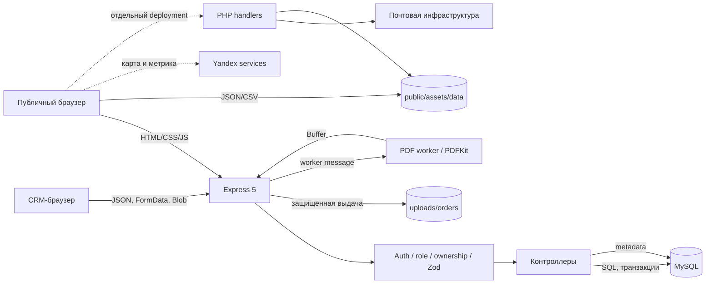
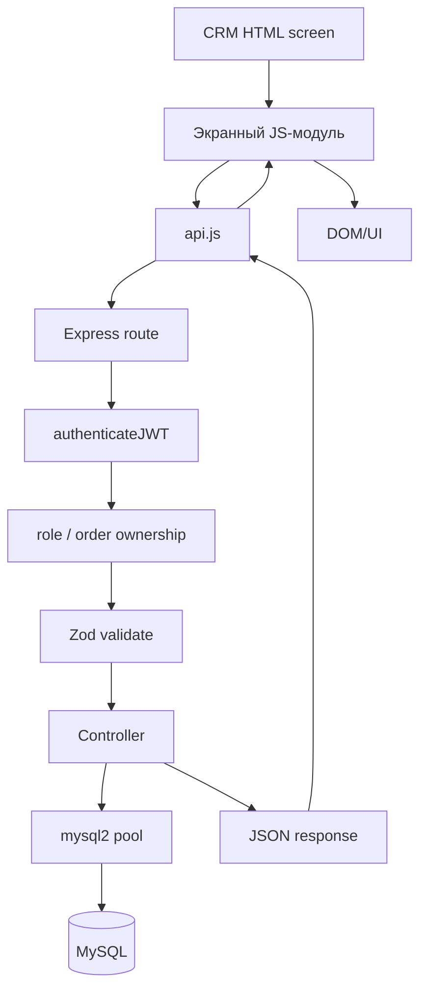
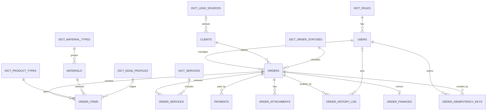
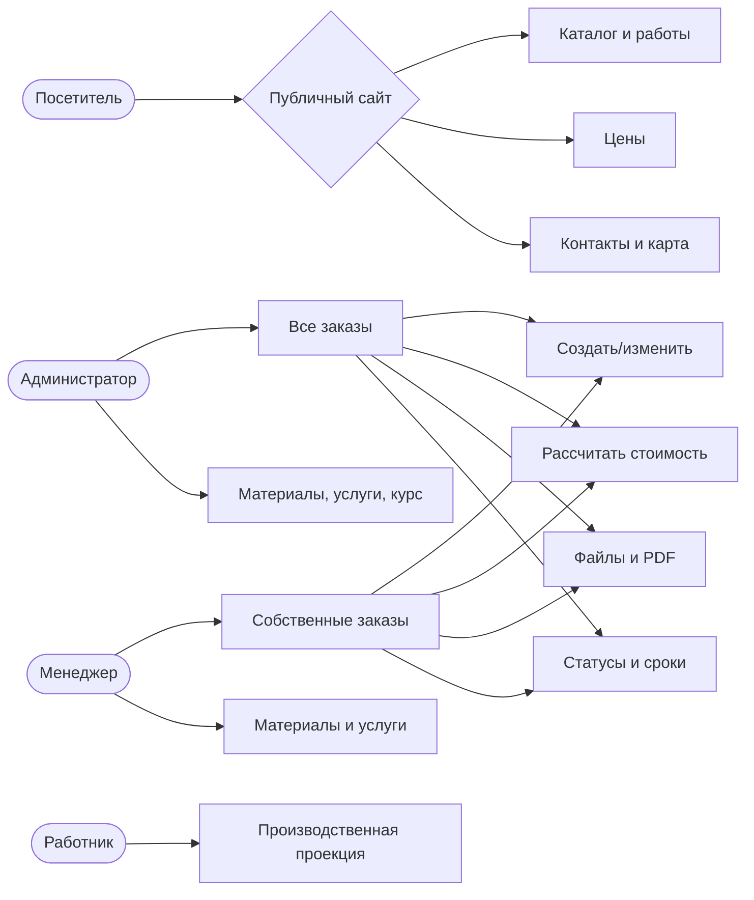
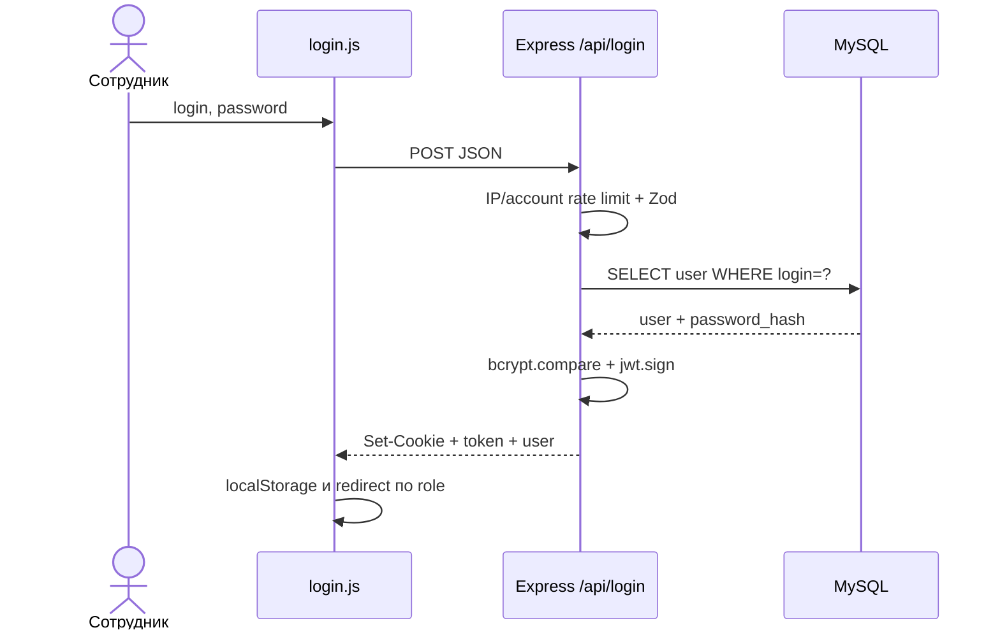
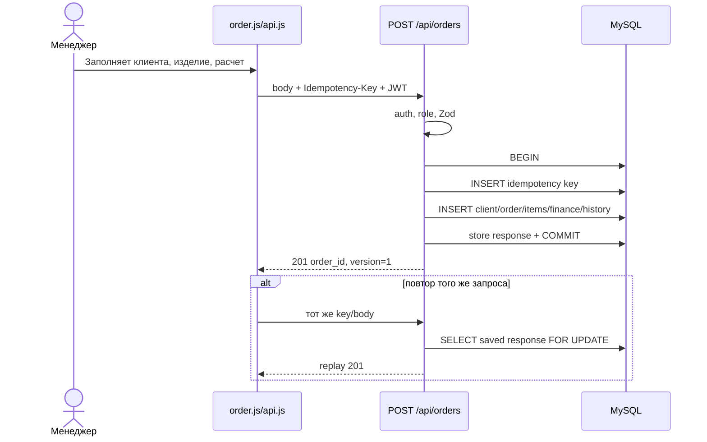
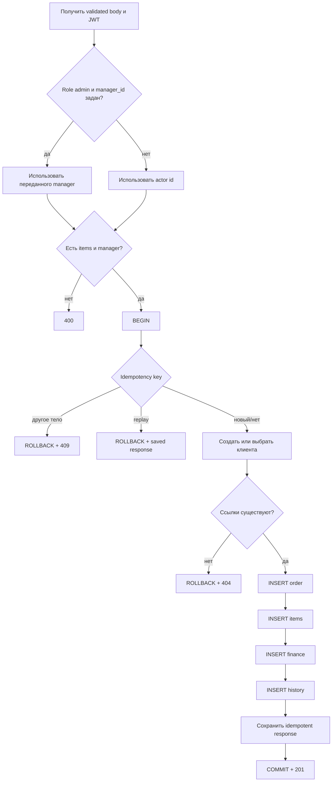

# Системный анализ программного средства «ПРО Камень»

Дата актуализации: 29 августа 2026 г.

Основание: фактическое состояние рабочего дерева проекта. При расхождении комментариев, ранее подготовленных документов и выполняемого кода приоритет отдан исходному коду. Номера строк соответствуют состоянию файлов на дату анализа.

## 1. Краткое резюме проекта

«ПРО Камень» представляет собой объединенный веб-проект из двух функционально различных частей:

1. публичного информационного сайта компании, который отображает услуги, каталог материалов, примеры работ, цены и контактные сведения;
2. внутренней системы управления взаимоотношениями с клиентами (Customer Relationship Management, CRM), предназначенной для учета клиентов и заказов, расчета стоимости изделий, контроля этапов выполнения, хранения файлов, финансового снимка заказа и формирования коммерческого предложения в формате Portable Document Format (PDF).

Основной исполняемый контур CRM построен по клиент-серверной схеме: браузерный интерфейс вызывает программный интерфейс приложения (Application Programming Interface, API) на Express, сервер проверяет JSON Web Token (JWT), права и входные данные, после чего выполняет параметризованные запросы к MySQL. Публичная часть преимущественно получает данные из JSON- и CSV-файлов и формирует Document Object Model (DOM) в браузере (`backend/server.js:31-93`, `public/crm/crm/js/api.js:95-193`, `public/js/storage.js:15-70`).

Система ориентирована на три внутренние роли: администратор, менеджер и работник производства. Администратор работает со всеми заказами и системным курсом, менеджер — только со своими заказами, работник — с ограниченной производственной проекцией. Роли и начальные значения определены в миграции (`backend/migrations/001_baseline.sql:220-249`), а фактические проверки доступа реализованы в middleware (`backend/middleware/orderAccess.js:12-65`).

Проект не использует этап сборки frontend: HTML, CSS и JavaScript раздаются Express непосредственно из `public/` (`backend/server.js:103-137`). Основная CRM требует Node.js, MySQL и корректно заданного `JWT_SECRET`; PHP-обработчики публичной части присутствуют в репозитории, но Express намеренно блокирует путь `/php`, поэтому их выполнение требует отдельного PHP-окружения и иной схемы публикации (`backend/server.js:132-137`).

## 2. Используемые технологии и их фактическое назначение

| Технология | Фактическое назначение | Подтверждение |
|---|---|---|
| HTML5, CSS3 | Разметка публичных страниц и экранов CRM; собственные стили публичной части | `public/index.html:1-379`, `public/css/base.css`, `public/css/layout.css`, `public/css/components.css` |
| JavaScript ES modules | Загрузка, проверка и отображение JSON/CSV на публичном сайте | `public/js/main.js:1-31`, `public/js/app.js:18-218` |
| Обычный браузерный JavaScript | CRM-экраны, API-клиент, канбан, карточка заказа, калькулятор, справочники | `public/crm/crm/js/api.js:95-358`, `public/crm/crm/js/order.js:491-1547` |
| Tailwind CSS через CDN | Оформление всех CRM-страниц без локальной сборки CSS | `public/crm/crm/login.html:6-8`, `public/crm/crm/dashboard.html:6-8` |
| Node.js, CommonJS | Среда выполнения backend, worker threads и служебных сценариев | `backend/package.json:5-24`, `backend/routes/orders.routes.js:48-50` |
| Express 5 | HTTP-сервер, middleware, API, статика и обработка ошибок | `backend/package.json:30`, `backend/server.js:1-11`, `backend/server.js:71-224` |
| MySQL, mysql2/promise | Постоянное хранение CRM-данных и транзакционные операции | `backend/db.js:1-15`, `backend/controllers/ordersController.js:801-979` |
| Zod | Серверная проверка тел изменяющих запросов | `backend/middleware/schemas.js:1-194`, `backend/middleware/validate.js:3-27` |
| JWT, jsonwebtoken | Аутентификация запросов и перенос идентификатора пользователя/роли | `backend/controllers/authController.js:34-45`, `backend/middleware/auth.js:17-35` |
| bcrypt | Проверка хеша пароля пользователя | `backend/controllers/authController.js:16-31` |
| cookie-parser | Чтение JWT из httpOnly cookie | `backend/server.js:3-46`, `backend/middleware/auth.js:17-28` |
| CORS | Ограничение допустимых браузерных origin и поддержка credentials | `backend/server.js:17-43` |
| Multer | Прием до 20 вложений размером до 50 МиБ каждое | `backend/routes/orders.routes.js:71-133` |
| PDFKit | Формирование PDF-коммерческого предложения | `backend/package.json:34`, `backend/workers/pdf.worker.js:57-340` |
| worker_threads | Вынос PDF-генерации из основного потока с тайм-аутом 30 секунд | `backend/routes/orders.routes.js:48-50`, `backend/routes/orders.routes.js:556-589` |
| JSON и CSV | Каталог, портфолио, контакты, контент и публичная таблица цен | `public/js/storage.js:15-21`, `public/js/app.js:11-12` |
| localStorage | Пользовательский кэш публичных данных, JWT/user UI-state и черновики калькулятора | `public/js/storage.js:24-76`, `public/crm/crm/js/api.js:98-106`, `public/crm/crm/js/api.js:364-405` |
| PHP | Альтернативные обработчики публичной формы и редактирования JSON-контента | `public/php/send-mail.php:1-261`, `public/php/admin_handler.php:1-475` |
| Yandex Maps/Метрика | Карта контактов и веб-аналитика публичных страниц | `public/js/main.js:764-809`, `public/index.html:43-59` |
| html2pdf.js через CDN | Клиентская библиотека подключена в карточке заказа; основной PDF скачивается с серверного endpoint | `public/crm/crm/order.html:7-12`, `public/crm/crm/js/order.js:471-484` |

Зависимости backend зафиксированы в `backend/package-lock.json`; обновление или установка новых библиотек для анализа не выполнялись.

## 3. Карта структуры проекта

| Путь | Назначение | Связь с компонентами |
|---|---|---|
| `backend/server.js` | Точка входа Express, CORS, middleware, маршруты, статика, проверка схемы, запуск | Подключает `routes/`, `db.js`, `requestContext`, защищенную выдачу uploads |
| `backend/db.js` | Пул MySQL с лимитом 10 соединений | Используется всеми контроллерами и middleware объектного доступа |
| `backend/routes/` | Объявление HTTP-методов, путей и цепочек middleware | Делегирует бизнес-операции `controllers/` |
| `backend/controllers/` | Аутентификация, заказы, клиенты, материалы, услуги и настройки | Выполняет SQL через `db.js`, возвращает JSON |
| `backend/middleware/auth.js` | Проверка JWT из Bearer или cookie | Заполняет `req.user` для последующих проверок |
| `backend/middleware/authorize.js` | Общая ролевая проверка | Используется справочниками, клиентами и настройками |
| `backend/middleware/orderAccess.js` | Объектная авторизация заказа | Сопоставляет `orders.manager_id` с JWT пользователя |
| `backend/middleware/schemas.js`, `validate.js` | Zod-схемы и единый формат ошибок валидации | Подключены к изменяющим API-маршрутам |
| `backend/middleware/rateLimit.js` | In-memory ограничитель частоты запросов | Две независимые квоты применены к login |
| `backend/middleware/requestContext.js` | UUID запроса и структурированный access-log | Устанавливает `X-Request-ID`, пишет метод, маршрут, статус и задержку |
| `backend/utils/stateMachine.js` | Набор известных статусов и фактическая политика переходов | Вызывается при изменении заказа и статуса |
| `backend/utils/fileSignatures.js`, `filenames.js` | Проверка magic bytes и безопасная обработка имен файлов | Используются upload/download маршрутами |
| `backend/workers/pdf.worker.js` | Формирование PDF в отдельном worker thread | Получает снимок заказа от `orders.routes.js` |
| `backend/migrations/001_baseline.sql` | Полная схема новой БД и начальные справочники | Первый шаг versioned migration runner |
| `backend/migrations/002_*.sql`–`004_*.sql` | Уникальность финансов, optimistic locking, идемпотентность | Обязательны для запуска текущего сервера |
| `backend/migrations/sprint2_tables.sql` | Историческая/ручная миграция Sprint 2 | Не выбирается runner, поскольку имя не соответствует `NNN_*.sql` |
| `backend/scripts/migrate.js` | Последовательное применение `NNN_*.sql` | Учитывает версии в `schema_migrations`, требует защитный флаг |
| `backend/scripts/adopt-baseline.js` | Явное принятие существующей legacy-схемы за baseline | Предшествует incremental migration существующей БД |
| `backend/scripts/test-*.js` | Проверка миграций и полный HTTP-интеграционный сценарий | Создает отдельные временные базы, не является unit-тестом |
| `backend/test/*.test.js` | Unit/regression/security тесты Node test runner | Запускаются `npm test` |
| `backend/test_sprint1.js` | Ручной сценарий для уже запущенного сервера | Требует `TEST_ADMIN_LOGIN`, `TEST_ADMIN_PASSWORD` |
| `pro_erp_structure.sql` | Исторический SQL-дамп структуры | Не является актуальной полной схемой текущего приложения |
| `public/index.html`, `public/pages/` | Публичные страницы | Подключают `/js/main.js` или `/js/app.js` и данные из assets |
| `public/js/main.js` | Общий публичный UI, каталог, работы, контакты, карта | Использует `storage.js`, JSON и DOM |
| `public/js/app.js` | Загрузка, разбор и отображение CSV-прайса | Используется `pages/price.html` |
| `public/js/storage.js` | Версионированный fetch и fallback на localStorage | Источник данных для `main.js` |
| `public/js/render.js`, `validate.js` | Безопасные шаблоны, фильтры и проверка JSON | Поддерживают публичный каталог/портфолио |
| `public/assets/data/` | 36 позиций каталога, 18 работ, контакты и 11 строк прайса | Читаются публичным JavaScript и PHP-admin |
| `public/assets/images/` | Изображения каталога, работ, партнеров и интерфейса | Пути хранятся в HTML/JSON; локальные ссылки проверены скриптом |
| `public/crm/crm/*.html` | Login, канбан, карточка заказа, производство, клиенты, архив, справочники, отдельный калькулятор | Загружают общий `js/api.js` и экранный модуль |
| `public/crm/crm/js/api.js` | Единый REST-клиент CRM | Нормализует URL, JWT/cookie, JSON/FormData, ошибки и скачивание Blob |
| `public/crm/crm/js/order.js` | Создание/редактирование заказа, сроки, финансы, калькулятор, вложения и PDF | Центральный клиентский модуль заказов |
| `public/crm/crm/js/kanban.js` | Канбан, поиск, drag-and-drop, optimistic UI | Вызывает list/status API |
| `public/crm/crm/js/production.js` | Производственная очередь | Использует обезличенный `/api/orders/production` |
| `public/crm/crm/js/admin.js` | Материалы, услуги и системный курс | Доступ ограничивается и UI, и backend |
| `public/php/` | Отдельные PHP-обработчики контактов и JSON-admin | Express не исполняет и не раздает этот каталог |
| `CONTEXT.md` | Технический контекст текущей архитектуры | Использован как вторичный источник, проверен по коду |
| `TECHNICAL_AUDIT.md` | История аудита, исправлений и прошлых прогонов | Не заменяет текущую проверку исходного кода |
| `docs/BACKUP_AND_RESTORE.md` | Runbook резервного копирования и восстановления MySQL/uploads | Документирует эксплуатационный процесс, но не автоматизирует его |

## 4. Архитектурный анализ

### 4.1. Архитектурный стиль

Основной контур является слоистым клиент-серверным веб-приложением с REST-подобным JSON API. В backend различимы транспортный слой (`routes`), прикладной слой (`controllers`), сквозные проверки (`middleware`) и слой доступа к данным на основе SQL-запросов через общий пул. Отдельного слоя репозиториев или объектно-реляционного отображения (Object-Relational Mapping, ORM) нет: контроллеры содержат и прикладные правила, и SQL (`backend/controllers/ordersController.js:210-377`, `backend/controllers/ordersController.js:382-756`).

Frontend также разделен на два контура. Публичный сайт использует ES modules и файловые данные. CRM использует глобальные браузерные скрипты и единый объект `api`, после чего каждый экран реализует собственное управление DOM (`public/js/main.js:1-31`, `public/crm/crm/js/api.js:199-358`).

### 4.2. Компоненты и взаимодействие

- Браузер публичного сайта запрашивает HTML/CSS/JS и JSON/CSV у Express static. При недоступности JSON `storage.js` может вернуть ранее сохраненный объект из localStorage (`public/js/storage.js:32-70`).
- CRM передает JSON, multipart/form-data или запрос Blob в Express. `apiFetch` добавляет Bearer JWT и cookie credentials (`public/crm/crm/js/api.js:95-124`).
- Express применяет request context, JSON parser, cookie parser, а затем маршрутные цепочки аутентификации, авторизации и валидации (`backend/server.js:31-46`, `backend/routes/orders.routes.js:174-216`).
- Контроллеры выполняют параметризованные SQL-запросы. Составные изменения заказа оборачиваются в MySQL-транзакции (`backend/controllers/ordersController.js:801-979`, `backend/controllers/ordersController.js:991-1174`).
- Вложения сохраняются в файловой системе, метаданные — в `order_attachments`; выдача обоих путей защищена JWT и ownership-проверкой (`backend/server.js:48-55`, `backend/routes/orders.routes.js:211-286`).
- PDF строится worker-потоком на основе данных заказа и snapshot (`backend/routes/orders.routes.js:493-589`).
- PHP-контур обращается к JSON-файлам и почтовой функции PHP, однако не маршрутизируется Express (`public/php/admin_handler.php:287-475`, `public/php/send-mail.php:173-261`).

### 4.3. Движение данных в основных операциях

**Вход.** Login/password проходят два rate limit, Zod-проверку, выборку пользователя по параметру и `bcrypt.compare`. При успехе сервер подписывает JWT на 24 часа, помещает его в httpOnly cookie и одновременно возвращает token в JSON. Клиент сохраняет token и представление пользователя в localStorage (`backend/routes/auth.routes.js:8-28`, `backend/controllers/authController.js:12-48`, `public/crm/crm/js/auth.js:14-26`).

**Создание заказа.** Клиент формирует сведения о клиенте, позиции, суммах, сроках и snapshot. Сервер определяет владельца по роли, захватывает idempotency key, создает либо использует клиента, проверяет внешние ключи, записывает `orders`, `order_items`, `order_finances`, историю и сохраненный ответ в одной транзакции (`backend/controllers/ordersController.js:758-979`).

**Изменение заказа.** Сервер блокирует строку `FOR UPDATE`, сравнивает поле `version`, обновляет разрешенные поля и финансовое зеркало, увеличивает version и фиксирует историю. Устаревший клиент получает HTTP 409 (`backend/controllers/ordersController.js:407-445`, `backend/controllers/ordersController.js:532-549`).

**Изменение калькулятора.** Отдельный endpoint синхронизирует snapshot, одну позицию заказа, сумму, курс, финансовую запись и историю. Заказ с более чем одной позицией отклоняется 409, поскольку UI не предоставляет выбор позиции (`backend/controllers/ordersController.js:982-1174`).

**Перемещение по канбану.** UI сначала выполняет optimistic move, отправляет status и version, а при ошибке возвращает карточку и перечитывает состояние. Сервер проверяет известность статуса, version и пишет историю транзакционно (`public/crm/crm/js/kanban.js:342-471`, `backend/controllers/ordersController.js:1178-1256`).

### 4.4. Фактический API

| Метод и путь | Доступ | Вход | Успешный результат | Реализация |
|---|---|---|---|---|
| `GET /api/health` | публичный | — | `{success,status,db}` | `backend/server.js:71-80` |
| `POST /api/login` | публичный, rate limited | `{login,password}` | JWT и объект user | `backend/routes/auth.routes.js:21-27` |
| `POST /api/logout` | публичный | — | очистка cookie | `backend/routes/auth.routes.js:28` |
| `GET /api/orders` | admin; manager — свои | — | массив заказов | `backend/routes/orders.routes.js:174` |
| `GET /api/orders/production` | admin/manager/worker | — | производственная проекция | `backend/routes/orders.routes.js:175-180` |
| `GET /api/orders/:id` | admin; manager-владелец | positive integer id | `{success,order}` | `backend/routes/orders.routes.js:181` |
| `POST /api/orders` | admin/manager | order schema, optional `Idempotency-Key` | 201, id/version | `backend/routes/orders.routes.js:189-195` |
| `PUT /api/orders/:id` | admin; manager-владелец | partial order + обязательная version | новая version | `backend/routes/orders.routes.js:182-188` |
| `PUT /api/orders/:id/calculator` | admin; manager-владелец | snapshot, total, rate, version | новая version | `backend/routes/orders.routes.js:196-202` |
| `PUT /api/orders/:id/status` | admin; manager-владелец | status, optional comment, version | новая version | `backend/routes/orders.routes.js:203-209` |
| `POST /api/orders/:id/upload` | admin; manager-владелец | до 20 files + file_type | метаданные файлов | `backend/routes/orders.routes.js:211-267` |
| `GET /api/orders/:id/attachments` | admin; manager-владелец | id | список вложений | `backend/routes/orders.routes.js:286-313` |
| `GET /api/orders/:id/attachments/:attachmentId/download` | admin; manager-владелец | ids | файл | `backend/routes/orders.routes.js:315-370` |
| `DELETE /api/orders/:id/attachments/:attachmentId` | admin; manager-владелец | ids | результат удаления | `backend/routes/orders.routes.js:372-491` |
| `GET /api/orders/:id/pdf` | admin; manager-владелец | id | `application/pdf` | `backend/routes/orders.routes.js:493-550` |
| `GET /api/orders/:id/history` | admin; manager-владелец | id | история | `backend/routes/orders.routes.js:592-618` |
| `GET /api/clients` | admin/manager | — | массив клиентов с агрегатами | `backend/routes/clients.routes.js:7-8` |
| `GET /api/materials` | любой запрос с валидным JWT; отдельная проверка role отсутствует | — | `{success,materials}` | `backend/routes/materials.routes.js:21` |
| `POST, PUT /api/materials` | admin/manager | material schema | JSON результата | `backend/routes/materials.routes.js:29-43` |
| `DELETE /api/materials/:id` | admin | id | JSON результата | `backend/routes/materials.routes.js:45-50` |
| `GET, PUT /api/services` | admin/manager | PUT: `{services: record}` | словарь услуг | `backend/routes/materials.routes.js:22-27`, `backend/routes/materials.routes.js:52-58` |
| `GET /api/exchange-rate` | admin/manager | — | `{exchange_rate}` | `backend/routes/settings.routes.js:21-26` |
| `PUT /api/exchange-rate` | admin | positive number | обновленный курс | `backend/routes/settings.routes.js:28-34` |

## 5. Анализ базы данных

### 5.1. Источник актуальной схемы

Для новой установки актуальной является последовательность `001_baseline.sql` → `002_unique_order_finances.sql` → `003_orders_version.sql` → `004_order_idempotency.sql`. Runner выбирает только имена `NNN_*.sql` и записывает их в `schema_migrations` (`backend/scripts/migrate.js:33-64`). `pro_erp_structure.sql` — исторический дамп, а `sprint2_tables.sql` — ручной legacy-файл; они не должны использоваться как единственное описание текущей схемы.

### 5.2. Сущности, поля и ограничения

| Сущность | Ключевые поля | Ключи и связи | Назначение |
|---|---|---|---|
| `schema_migrations` | `migration_name`, `applied_at` | PK migration_name | Учет примененных версий (`backend/migrations/001_baseline.sql:1-4`) |
| `dict_roles` | role_id, role_name, description | PK; unique role_name | Справочник ролей (`backend/migrations/001_baseline.sql:6-12`) |
| `users` | user_id, role_id, full_name, login, password_hash | FK role; unique login | Учетные записи сотрудников (`backend/migrations/001_baseline.sql:14-24`) |
| `dict_lead_sources` | source_id, source_name | PK; unique name | Нормализованный источник клиента (`backend/migrations/001_baseline.sql:26-31`) |
| `clients` | имя, телефон, email, address, social_networks | FK source SET NULL; индекс phone | Карточка клиента (`backend/migrations/001_baseline.sql:33-46`) |
| `dict_order_statuses` | string status_id, name, sort_order | PK status_id | Этапы жизненного цикла (`backend/migrations/001_baseline.sql:48-53`) |
| `dict_material_types` | type_id, Russian name | PK | Категории материалов (`backend/migrations/001_baseline.sql:55-59`) |
| `dict_product_types` | type_id, type_name | PK | Типы изделий (`backend/migrations/001_baseline.sql:61-65`) |
| `dict_edge_profiles` | profile_id, name, price | PK | Профили кромки (`backend/migrations/001_baseline.sql:67-72`) |
| `dict_services` | service_id, name, unit, price | PK; unique name | Справочник услуг (`backend/migrations/001_baseline.sql:74-81`) |
| `materials` | material_id, type_id, title, fabricator, color, price | PK string; FK type RESTRICT | Материалы калькулятора (`backend/migrations/001_baseline.sql:83-93`) |
| `orders` | client, manager, status, dates, totals, rate, JSON snapshots, version | FK client/manager/status RESTRICT; indexes; optimistic version | Агрегат заказа (`backend/migrations/001_baseline.sql:95-118`, `backend/migrations/003_orders_version.sql:1-2`) |
| `order_items` | product/material, dimensions, area, edge, item_cost | FK order CASCADE; прочие FK RESTRICT | Позиции заказа (`backend/migrations/001_baseline.sql:120-142`) |
| `order_services` | order, service, quantity, total_cost | FK order CASCADE, service RESTRICT | Связь заказа с услугами (`backend/migrations/001_baseline.sql:144-155`) |
| `payments` | order, amount, type, date | FK order CASCADE | Отдельные платежи (`backend/migrations/001_baseline.sql:157-166`) |
| `order_attachments` | order, names/path/type/date | FK order CASCADE | Метаданные файлов (`backend/migrations/001_baseline.sql:168-178`) |
| `order_history_log` | order, action, description, user, date | FK order CASCADE, user SET NULL | Аудит действий (`backend/migrations/001_baseline.sql:180-192`) |
| `order_finances` | costs/revenue/prepayment/balance в cents, rate, JSON | FK order CASCADE; unique order_id после 002 | Финансовое зеркало 1:1 (`backend/migrations/001_baseline.sql:194-212`, `backend/migrations/002_unique_order_finances.sql:1-2`) |
| `system_settings` | key, text value, updated_at | PK key | Системные параметры (`backend/migrations/001_baseline.sql:214-218`) |
| `order_idempotency_keys` | actor/key/hash/order/status/body/date | unique actor+key; FK actor/order CASCADE | Повторяемость POST без дублей (`backend/migrations/004_order_idempotency.sql:1-17`) |

### 5.3. Связи и целостность

Центральной сущностью является `orders`. Каждый заказ обязан ссылаться на существующих клиента, менеджера и статус. Позиции, услуги, платежи, вложения, журнал и финансы связаны с заказом. Для зависимых данных используется `ON DELETE CASCADE`; для справочных значений, пользователя и клиента — преимущественно `RESTRICT`, что препятствует удалению используемых записей (`backend/migrations/001_baseline.sql:115-117`, `backend/migrations/001_baseline.sql:138-165`).

Связь `orders`–`order_finances` логически и после миграции 002 физически является 1:0..1. Контроллеры стремятся создавать или восстанавливать финансовую строку, однако отсутствие `NOT NULL`-обязательности на уровне orders означает, что сама БД не гарантирует наличие finance для каждого заказа.

### 5.4. Нормализация и дублирование

Справочники ролей, статусов, материалов, услуг, типов изделий и кромок вынесены в отдельные таблицы, что соответствует нормализованной реляционной модели. Одновременно присутствует намеренная денормализация:

- `orders.total_amount`/`prepayment` дублируются в `order_finances` в центах;
- `orders.calculator_snapshot` дублируется как `order_finances.calculation_snapshot`;
- `orders.stone_name` дублирует сведения материала;
- `orders.product_type` сосуществует с `order_items.product_type_id`;
- `orders.order_source` сосуществует с нормализованным `clients.source_id`.

Такое решение ускоряет чтение карточки и сохраняет снимок расчета, но требует атомарной синхронизации. Специальный calculator endpoint ее обеспечивает, тогда как legacy/ручные изменения БД могут создавать расхождения (`backend/controllers/ordersController.js:1098-1153`).

### 5.5. Денежные типы

Суммы заказа хранятся как `DECIMAL(10,2)`, а финансовое зеркало — как целые центы `INT`. Zod ограничивает сумму 20 000 000 BYN, чтобы умножение на 100 не превысило signed INT (`backend/middleware/schemas.js:43-49`). Использование двух представлений обосновано точностью финансовых вычислений, но является источником сложности согласования.

## 6. Основные функции

| Функция и сценарий | Задействованные файлы | Вход и последовательность | Результат и ошибки |
|---|---|---|---|
| Просмотр публичного каталога | `main.js`, `storage.js`, `validate.js`, `render.js`, `catalog.json` | Fetch → проверка массива → фильтр chips → безопасный шаблон DOM | Карточки материалов; fallback на cache; ошибка отображается в UI (`public/js/main.js:300-416`) |
| Просмотр работ | `main.js`, `render.js`, `works.json` | Загрузка 18 записей → фильтр → галерея/карточки | Портфолио; некорректные записи отсеиваются (`public/js/main.js:417-604`) |
| Публичный прайс | `app.js`, `price.csv` | Определение delimiter → CSV parser с кавычками → таблица | HTML-таблица или сообщение об ошибке (`public/js/app.js:18-201`) |
| Аутентификация | login HTML/JS, API, auth route/controller | login/password → quotas → Zod → user SQL → bcrypt → JWT | Cookie + JSON token/user; 400/401/429/500 (`backend/controllers/authController.js:12-54`) |
| Просмотр канбана | `kanban.js`, `getAllOrders` | JWT → роль → owner-filter для manager → SQL join | Массив заказов, скрытие archived/cancelled; 401/403/500 (`backend/controllers/ordersController.js:210-243`) |
| Создание заказа | `order.js`, order schema/controller | Client/item/snapshot → idempotency → transaction → client/order/items/finance/history | 201 + order id/version; 400/404/409/500 (`backend/controllers/ordersController.js:758-979`) |
| Редактирование карточки | `order.js`, `updateOrder` | partial body + version → lock → merge/update → finance/history | новая version; 400/403/404/409/500 (`backend/controllers/ordersController.js:382-756`) |
| Расчет стоимости | `order.js`, `updateOrderCalculator` | Размеры, кромки, material/services, rate → client calculation → validated snapshot → transaction | Согласованные snapshot/item/order/finance; 404/409/500 (`public/crm/crm/js/order.js:1089-1540`) |
| Этапы и сроки | `order.js`, `kanban.js`, `stateMachine.js` | status/comment/version или date inputs → validation → transaction | Новая version и history; unknown status/invalid date/stale version (`backend/controllers/ordersController.js:1178-1256`) |
| Клиентская база | `clients.js`, `clientsController.js` | SQL LEFT JOIN orders, COUNT/SUM, client-side search | Массив с orders_count и totalRevenue; 500 (`backend/controllers/clientsController.js:6-29`) |
| Производственная доска | `production.js`, `getProductionOrders` | JWT любой роли; status IN трех производственных этапах | Минимальная проекция без клиента/финансов (`backend/controllers/ordersController.js:245-272`) |
| Материалы/услуги/курс | `admin.js`, controllers/routes | Роль → Zod → parameterized SQL; услуги одной транзакцией | Справочники/обновление; 400/403/404/409/500 (`backend/controllers/materialsController.js:179-226`) |
| Вложения | `attachments.js`, `order.js`, order routes | Multipart → extension → magic bytes → transaction/metadata; download с ownership | Метаданные/файл; 400/401/403/404/409/500 (`backend/routes/orders.routes.js:91-170`, `backend/routes/orders.routes.js:211-491`) |
| PDF | `order.js`, route, worker | GET order → snapshot → worker → PDFKit | Blob/PDF; 401/403/404/500/30-sec timeout (`backend/routes/orders.routes.js:493-589`) |
| Журнал действий | order controller/routes | При транзакционных действиях вставляется actor/action/description | Обратная хронология; при удаленном user — «Система» (`backend/routes/orders.routes.js:592-617`) |

## 7. Готовые разделы пояснительной записки

### 7.1. Общая характеристика программного средства

Разработанное программное средство «ПРО Камень» представляет собой веб-систему, объединяющую публичное информационное представительство организации и внутреннюю CRM. Публичная часть обеспечивает представление сведений об услугах, материалах, выполненных работах, ценах и контактных данных. Внутренняя часть обеспечивает регистрацию и сопровождение заказов, хранение сведений о клиентах, расчет стоимости, контроль производственных этапов, учет финансового состояния заказа, работу с вложениями и формирование коммерческого предложения.

Программное средство реализовано как браузерное приложение с серверным API и реляционной базой данных. Доступ к внутренним функциям требует аутентификации. Основные операции записи выполняются на сервере и сопровождаются валидацией, проверкой прав и журналированием.

### 7.2. Назначение и область применения

Назначением системы является информационная поддержка деятельности предприятия, изготавливающего изделия из камня. Система применяется при обработке входящих обращений, подготовке расчета, согласовании заказа, передаче его в производство, контроле сроков, учете оплаты и хранении связанных материалов.

Целевыми пользователями публичной части являются потенциальные и действующие клиенты. Целевыми пользователями CRM являются администратор системы, менеджеры и работники производства. Система рассчитана на эксплуатацию в браузере при доступности Express-сервера и MySQL; отдельные публичные PHP-функции требуют PHP-совместимого веб-сервера.

### 7.3. Постановка задачи

Необходимо было разработать программное средство, которое централизует сведения о клиентах и заказах, снижает вероятность потери данных между этапами обработки, поддерживает расчет стоимости изделий и предоставляет актуальную информацию сотрудникам в соответствии с их ролью. Дополнительно требовалось обеспечить публичное представление каталога, работ и контактов организации.

Для решения задачи реализованы: публичные страницы; аутентификация сотрудников; карточка клиента и заказа; канбан этапов; производственная очередь; калькулятор; справочники материалов и услуг; хранение файлов; журнал действий; PDF-коммерческое предложение; средства миграции и автоматизированной проверки.

### 7.4. Функциональные требования

Программное средство должно обеспечивать:

- отображение публичной информации из структурированных файлов;
- вход сотрудника по логину и паролю и завершение сеанса;
- создание, просмотр и изменение заказов;
- назначение ответственного менеджера согласно роли;
- ведение контактных данных клиента;
- хранение одной или нескольких позиций заказа на уровне модели данных;
- расчет стоимости единственной выбранной UI-позиции и сохранение снимка расчета;
- изменение статуса и сроков заказа;
- отображение канбан-доски, архива и производственной очереди;
- ведение материалов, услуг и системного курса;
- загрузку, получение и удаление вложений;
- формирование PDF;
- фиксацию значимых действий в журнале.

Уточнение: интерфейс калькулятора фактически работает с одной позицией. Поддержка нескольких `order_items` присутствует в модели и общем API, но специальное обновление калькулятора отклоняет многопозиционный заказ.

### 7.5. Нефункциональные требования

Фактически реализованные нефункциональные свойства включают:

- использование параметризованных SQL-запросов;
- проверку JWT, ролей и принадлежности заказа;
- ограничение частоты попыток входа;
- серверную валидацию изменяющих запросов;
- транзакционность составных операций;
- optimistic locking с помощью `orders.version`;
- идемпотентность создания заказа в пределах actor/key;
- контроль размера, расширения и сигнатуры файла;
- структурированный access-log с request ID;
- честные JSON 404 для неизвестных API и отсутствие SPA-подмены для файлов;
- совместимость frontend без сборки с современными браузерами.

Не подтверждены исходным кодом количественные требования к доступности, времени ответа, числу одновременных пользователей, Recovery Point Objective (RPO) и Recovery Time Objective (RTO) как гарантии эксплуатации. Значения RPO/RTO в backup runbook являются целевыми организационными правилами, а не измеренным свойством приложения (`docs/BACKUP_AND_RESTORE.md:1-59`).

### 7.6. Выбор и обоснование технологий

Node.js и Express выбраны для реализации HTTP API на одном языке с браузерной частью. Express предоставляет маршрутизацию и композицию middleware, что используется для последовательного применения аутентификации, авторизации и валидации. MySQL обеспечивает реляционные связи, внешние ключи и транзакции, необходимые для согласованной записи заказа и зависимых сущностей.

Zod используется как декларативный механизм проверки JSON до выполнения бизнес-операций. JWT обеспечивает stateless-проверку пользователя сервером, а bcrypt — сравнение пароля с криптографическим хешем. Multer применен для multipart-загрузок, PDFKit — для формирования PDF, worker threads — для изоляции ресурсоемкой генерации от основного event loop.

Отсутствие frontend build chain упрощает локальный запуск, но приводит к зависимости CRM от CDN Tailwind и html2pdf. JSON/CSV подходят для редко изменяемого публичного контента, однако не обеспечивают транзакционный совместный доступ, характерный для СУБД.

### 7.7. Архитектура программного средства

Архитектура включает браузерный уровень, сервер приложений и уровень данных. Публичный браузерный уровень получает статические ресурсы и файловые наборы данных. CRM использует централизованный API-клиент. Сервер Express принимает запрос, формирует контекст, выполняет аутентификацию, авторизацию и валидацию, после чего передает управление контроллеру. Контроллер выполняет SQL-запросы через пул MySQL. Файлы заказа размещаются в файловой системе, а их метаданные — в БД. PDF формируется отдельным worker-потоком.

Архитектура является модульным монолитом: все API-модули работают в одном Node.js-процессе и с одной базой. Отдельный PHP-контур не интегрирован в Express deployment.

### 7.8. Описание основных программных модулей

Модуль `server.js` конфигурирует приложение и порядок middleware. Маршруты группируют API по предметным областям. Контроллер аутентификации выполняет проверку учетных данных. Контроллер заказов реализует основной агрегат и транзакции. Контроллер материалов обслуживает материалы и услуги, контроллер настроек — курс валют, контроллер клиентов — агрегированную клиентскую базу.

На клиенте `api.js` унифицирует HTTP-вызовы и ошибки. `order.js` реализует карточку заказа и калькулятор, `kanban.js` — этапы, `production.js` — производственную проекцию, `clients.js` и `archive.js` — специализированные представления, `admin.js` — справочники. Публичные `main.js`, `storage.js`, `render.js`, `validate.js` образуют файловый контур контента.

### 7.9. Проектирование базы данных

База данных построена вокруг заказа. Нормализованные справочники задают роли, статусы, типы и услуги. Заказ связан с клиентом, менеджером и статусом обязательными внешними ключами. Состав заказа представлен дочерними позициями. Платежи, вложения, история, услуги и финансы связаны с заказом и удаляются каскадно вместе с ним.

Для финансового снимка применяется отдельная запись с денежными значениями в целых центах. Уникальность `order_finances.order_id` обеспечивает не более одной финансовой записи на заказ. Поле `version` поддерживает обнаружение конкурентных изменений. Таблица idempotency keys препятствует повторному созданию заказа при повторной отправке одинакового запроса.

### 7.10. Пользовательские роли и сценарии

Администратор имеет доступ ко всем заказам, может назначать менеджера, управлять материалами, услугами и курсом. Менеджер создает заказы от своего имени, работает только с заказами, где указан его `manager_id`, просматривает клиентов и изменяет материалы/услуги. Работник не получает полную карточку клиента и финансов; ему доступна производственная проекция и материалы.

Типовой сценарий менеджера включает вход, создание клиента и заказа, выполнение расчета, установление сроков, перемещение заказа по этапам, загрузку файлов и формирование PDF. Типовой сценарий работника включает вход, просмотр производственной очереди и изменение этапа доступного производственного заказа через соответствующий UI. При этом server-side endpoint изменения конкретного заказа для worker запрещен объектным middleware; текущее production UI вызывает общий status endpoint, поэтому возможность worker фактически изменить статус ограничена 403. Это противоречие требует отдельного решения (`backend/middleware/orderAccess.js:26-48`, `public/crm/crm/js/production.js:143-151`).

### 7.11. Реализация основных функций

Создание заказа реализовано транзакцией, включающей клиента, заказ, позиции, финансовую запись и журнал. Повторная отправка с тем же `Idempotency-Key` и тем же телом возвращает ранее сохраненный ответ, а с другим телом — конфликт. Изменение существующего заказа требует текущую version. Калькулятор сохраняет не только итог, но и исходные параметры, стоимость материала и производства, что обеспечивает последующее воспроизведение расчета.

Статусы представлены строковыми идентификаторами. Сервер отвергает неизвестный статус, но для менеджера разрешает свободное перемещение между всеми известными статусами, несмотря на наличие в исходнике неиспользуемой строгой карты. Причина отмены сохраняется как текстовое описание history.

### 7.12. Валидация и обработка ошибок

Zod проверяет календарные даты, диапазоны чисел, длины строк, обязательную version и допустимые статусы. Middleware возвращает HTTP 400 с машиночитаемыми `errors` и `details`. Клиент преобразует технические пути полей в понятные названия (`backend/middleware/validate.js:3-27`, `public/crm/crm/js/api.js:32-86`).

Контроллеры различают 400 для некорректного запроса, 401 для отсутствующей/невалидной аутентификации, 403 для недостатка прав, 404 для отсутствующей сущности, 409 для конфликта версии/идемпотентности/состояния и 500 для непредвиденной ошибки. Подробность SQL-ошибок пишется в server-side log, а большинство ответов пользователю нейтральны. Глобальный обработчик, однако, возвращает `err.message` для неизвестных ошибок, что может раскрыть лишнюю техническую информацию (`backend/server.js:198-223`).

### 7.13. Аутентификация, авторизация и безопасность

Пароли хранятся в виде bcrypt-хешей. JWT подписывается обязательным секретом и действует 24 часа. Токен поддерживается одновременно в httpOnly cookie и Bearer-заголовке. Cookie имеет `SameSite=Lax`, а в production — `Secure`. Авторизация сочетает ролевые проверки и проверку владельца заказа.

SQL-запросы используют placeholders. Загрузка ограничивает размер, число файлов, расширения и сигнатуры, генерирует серверное имя и защищает выдачу. Динамический CRM-контент в критических местах экранируется или задается через `textContent`. Login ограничен по IP и по IP+login.

Ограничения безопасности: JWT дублируется в localStorage и потому доступен JavaScript при успешной XSS; logout endpoint не требует JWT и не отзывает уже выданный Bearer token; нет server-side token revocation; rate limiter хранится только в памяти одного процесса; Content Security Policy и security headers middleware в коде не обнаружены; CSRF-защита Express API явно не реализована и опирается на SameSite/проверку JSON, тогда как PHP-admin имеет отдельный CSRF token (`public/php/admin_handler.php:273-285`).

### 7.14. Тестирование программного средства

В текущей сессии 29 августа 2026 г. выполнены:

- `npm test`: 37 тестов, 37 успешно, 0 ошибок;
- `npm run check:syntax`: синтаксис backend/public JavaScript успешно проверен;
- `npm run check:static`: проверено 18 HTML-файлов, отсутствующих локальных ссылок — 0.

Первый запуск unit-набора внутри ограниченной песочницы дал одну инфраструктурную ошибку `listen EPERM 127.0.0.1`; повторный запуск с разрешением локального listener завершился 37/37. Это не дефект прикладного кода.

`test:migrations` и `test:integration` в текущей сессии не выполнялись, так как создают и удаляют временные MySQL-базы. В `TECHNICAL_AUDIT.md:100-109` зафиксирован более ранний успешный полный прогон, но он приводится как документированный исторический результат, а не как новый запуск. PHP CLI отсутствовал при предыдущем аудите, поэтому динамический PHP-тест не подтвержден (`TECHNICAL_AUDIT.md:27-40`).

### 7.15. Развертывание и требования к окружению

Для запуска необходимы Node.js, установленные зависимости и MySQL. Минимальный порядок: задать DB-переменные и `JWT_SECRET`; для новой БД разрешить и выполнить migrations; затем запустить `npm start`. Сервер по умолчанию слушает порт 3000 (`backend/package.json:6-19`, `backend/server.js:509-537`).

Основные переменные: `DB_HOST`, `DB_PORT`, `DB_USER`, `DB_PASSWORD`, `DB_DATABASE`, `JWT_SECRET`, `PORT`, `FRONTEND_ORIGIN`, `NODE_ENV`, `DEBUG_STATIC`, `UPLOADS_DIR`. Миграции и административные скрипты дополнительно защищены флагами `ALLOW_SCHEMA_MIGRATIONS`, `ALLOW_BASELINE_ADOPTION`, `ALLOW_USER_RESEED`, `ALLOW_ATTACHMENT_FILENAME_REPAIR`.

Для PHP-контура необходимы PHP/web server, `PROKAMEN_RECIPIENT_EMAIL`, при необходимости SMTP-переменные и `PROKAMEN_ADMIN_PASSWORD_HASH` (`public/php/config.php:1-21`, `public/php/admin_handler.php:22-40`). Express сам PHP не выполняет.

### 7.16. Результаты разработки

В проекте реализован работоспособный программный контур от браузерного интерфейса до реляционного хранения: аутентификация, ролевая и объектная авторизация, CRUD-подобные операции со справочниками и заказами, транзакционный расчет, optimistic locking, идемпотентность, вложения, журнал и PDF. Публичная часть предоставляет самостоятельное информационное представление на основе структурированных данных.

Качество критических backend-механизмов подтверждается текущим набором из 37 unit/regression/security тестов и статическими проверками. Полный интеграционный прогон текущей сессией не подтвержден.

### 7.17. Ограничения и направления дальнейшего развития

Основными ограничениями являются отсутствие единой схемы исполнения PHP и Express; однопозиционный UI калькулятора при многопозиционной модели; отсутствие retention для idempotency keys; in-memory rate limit; зависимость CRM от CDN; отсутствие автоматизированного PHP lint в текущем контуре; наличие startup compatibility DDL; отсутствие структурированных old/new значений в history.

Рекомендуемые направления: определить политику worker status update; реализовать явный multi-item UX либо зафиксировать ограничение «один заказ — одна расчетная позиция»; централизовать rate limit; добавить CSP/security headers; отказаться от localStorage JWT при возможности cookie-only архитектуры; определить срок хранения idempotency keys; вынести SQL из крупного order controller в сервисы/репозитории; добавить CI с MySQL и PHP; завершить production rollout миграций после backup/restore test.

### 7.18. Заключение

Разработанное программное средство соответствует задачам информационного сопровождения заказов предприятия «ПРО Камень» и публичного представления его деятельности. Реализация содержит предметные механизмы расчета, этапов, финансов, файлов и ролей, а не только интерфейсные заготовки. Транзакции, version checks и idempotency повышают согласованность данных. Вместе с тем эксплуатационная готовность зависит от корректного применения миграций, конфигурации секретов, MySQL и выбора схемы публикации PHP-функций. Выявленные ограничения не отменяют реализованные функции, но должны учитываться при описании области применимости и дальнейшей разработке.

## 8. Показательные листинги исходного кода

Код ниже приведен без функциональных изменений. Многоточие обозначает пропуск несущественной для листинга части.

### Листинг 1 — проверка пароля и выпуск JWT

Источник: `backend/controllers/authController.js:12-48`.

```js
async function login(req, res) {
  const { login, password } = req.validatedBody;
  try {
    const [rows] = await pool.query("SELECT * FROM users WHERE login = ?", [login]);
    const user = rows[0];
    if (!user) {
      return res.status(401).json({ success: false, message: "Неверный логин или пароль" });
    }
    const isMatch = await bcrypt.compare(password, user.password_hash);
    if (!isMatch) {
      return res.status(401).json({ success: false, message: "Неверный логин или пароль" });
    }
    const token = jwt.sign(
      { user_id: user.user_id, role_id: user.role_id },
      JWT_SECRET,
      { expiresIn: "24h" },
    );
    res.cookie("token", token, {
      httpOnly: true,
      secure: process.env.NODE_ENV === "production",
      sameSite: "lax",
      maxAge: 86400000,
    });
    delete user.password_hash;
    res.json({ success: true, message: "Вход выполнен успешно!", token, user });
  } catch (error) { /* ... */ }
}
```

Назначение — аутентификация сотрудника. Входом являются проверенные login/password. Запрос параметризован, пароль сравнивается с хешем, а результатом является cookie и JSON с JWT/user. В архитектуре это точка создания доверенного identity context.

### Листинг 2 — JWT из Bearer или cookie

Источник: `backend/middleware/auth.js:17-35`.

```js
function authenticateJWT(req, res, next) {
  const token = extractBearerToken(req) || req.cookies?.token;
  if (!token) {
    return res.status(401).json({
      success: false,
      message: "Не авторизован. Токен отсутствует.",
    });
  }
  try {
    const decoded = jwt.verify(token, JWT_SECRET);
    req.user = decoded;
    next();
  } catch (error) {
    return res.status(401).json({
      success: false,
      message: "Токен недействителен или истёк.",
    });
  }
}
```

Middleware получает токен из двух транспортов, проверяет подпись и передает downstream `user_id`/`role_id`. Ошибкой является отсутствие или невалидность токена; результат — 401 либо продолжение цепочки.

### Листинг 3 — объектная авторизация заказа

Источник: `backend/middleware/orderAccess.js:26-50`.

```js
async function authorizeOrderObject(req, res, next) {
  const orderId = Number(req.params.id);
  try {
    const [rows] = await pool.query(
      "SELECT order_id, manager_id FROM orders WHERE order_id = ?",
      [orderId],
    );
    const order = rows[0];
    if (!order) {
      return res.status(404).json({ success: false, message: "Заказ не найден" });
    }
    if (req.user?.role_id === ROLES.ADMIN) {
      req.authorizedOrder = order;
      return next();
    }
    if (
      req.user?.role_id === ROLES.MANAGER &&
      Number(order.manager_id) === Number(req.user.user_id)
    ) {
      req.authorizedOrder = order;
      return next();
    }
    return deny(res);
  } catch (error) {
    return next(error);
  }
}
```

Входом являются JWT identity и order id. Алгоритм сначала различает отсутствие объекта и запрет доступа, затем разрешает администратора или менеджера-владельца. Это предотвращает горизонтальный доступ к чужим заказам.

### Листинг 4 — единый Zod validation boundary

Источник: `backend/middleware/validate.js:3-27`.

```js
function validate(schema) {
  return (req, res, next) => {
    try {
      const result = schema.safeParse(req.body);
      if (!result.success) {
        const details = result.error.issues.map((issue) => ({
          path: issue.path.map(String),
          message: issue.message,
        }));
        return res.status(400).json({
          success: false,
          message: "Ошибка валидации",
          errors: result.error.flatten().fieldErrors,
          details,
        });
      }
      req.validatedBody = result.data;
      next();
    } catch (error) {
      return res.status(400).json({ success: false, message: "Некорректный формат данных" });
    }
  };
}
```

Функция принимает Zod schema и возвращает Express middleware. Результат проверки помещается в `validatedBody`; ошибки возвращаются в двух представлениях для UI и диагностики.

### Листинг 5 — optimistic locking при изменении заказа

Источник: `backend/controllers/ordersController.js:407-432`, `backend/controllers/ordersController.js:532-549`.

```js
await connection.beginTransaction();
const [currentOrders] = await connection.query(
  `SELECT order_id, client_id, manager_id, status_id, total_amount,
          prepayment, version, exchange_rate, calculator_snapshot
   FROM orders WHERE order_id = ? FOR UPDATE`,
  [orderId],
);
const currentOrder = currentOrders[0];
if (!currentOrder) {
  await connection.rollback();
  return res.status(404).json({ success: false, message: "Заказ не найден" });
}
if (Number(currentOrder.version) !== Number(expectedVersion)) {
  await connection.rollback();
  return res.status(409).json({
    success: false,
    message: "Заказ был изменен другим пользователем",
    current_version: Number(currentOrder.version),
  });
}
// ... формирование updateFields
updateFields.push("version = version + 1");
const [versionedUpdate] = await connection.query(
  `UPDATE orders SET ${updateFields.join(", ")}
   WHERE order_id = ? AND version = ?`,
  [...updateValues, orderId, expectedVersion],
);
```

Входом являются partial update и ожидаемая version. Строка блокируется, версия сравнивается дважды — до обработки и в условии UPDATE. Результат предотвращает «потерянное обновление» при параллельной работе.

### Листинг 6 — захват ключа идемпотентности

Источник: `backend/controllers/ordersController.js:46-83`.

```js
async function claimIdempotencyKey(connection, actorId, key, hash) {
  if (!key) return { claimed: false };
  try {
    await connection.query(
      `INSERT INTO order_idempotency_keys
       (actor_id, idempotency_key, request_hash)
       VALUES (?, ?, ?)`,
      [actorId, key, hash],
    );
    return { claimed: true };
  } catch (error) {
    if (error.code !== "ER_DUP_ENTRY") throw error;
    const [rows] = await connection.query(
      `SELECT request_hash, response_status, response_body
       FROM order_idempotency_keys
       WHERE actor_id = ? AND idempotency_key = ?
       FOR UPDATE`,
      [actorId, key],
    );
    const existing = rows[0];
    if (!existing || existing.request_hash !== hash) return { conflict: true };
    if (existing.response_status && existing.response_body) {
      return {
        replay: true,
        status: Number(existing.response_status),
        body: normalizeJsonField(existing.response_body),
      };
    }
    return { conflict: true };
  }
}
```

Actor, key и canonical request hash определяют уникальную операцию. Первая транзакция захватывает ключ, повторная с тем же payload получает сохраненный ответ, а с другим — 409. Механизм защищает от дублей при retry.

### Листинг 7 — атомарная синхронизация калькулятора и финансов

Источник: `backend/controllers/ordersController.js:1098-1153`.

```js
const [orderUpdate] = await connection.query(
  `UPDATE orders
   SET calculator_snapshot = ?, stone_name = ?, total_amount = ?,
       exchange_rate = ?, version = version + 1
   WHERE order_id = ? AND version = ?`,
  [JSON.stringify(snapshot), snapshot.stoneName || null,
   totalAmount, exchangeRate, orderId, expectedVersion],
);
if (orderUpdate.affectedRows !== 1) {
  await connection.rollback();
  return res.status(409).json({
    success: false,
    message: "Заказ был изменен другим пользователем",
  });
}
const totalRevenueCents = toCents(totalAmount);
const prepaymentCents = toCents(currentOrder.prepayment);
const balanceCents = totalRevenueCents - prepaymentCents;
await connection.query(
  `INSERT INTO order_finances
   (order_id, stone_category, material_cost_cents, production_cost_cents,
    total_revenue_cents, prepayment_cents, balance_cents, currency,
    exchange_rate, calculation_snapshot)
   VALUES (?, ?, ?, ?, ?, ?, ?, 'BYN', ?, ?)
   ON DUPLICATE KEY UPDATE
     total_revenue_cents = VALUES(total_revenue_cents),
     prepayment_cents = VALUES(prepayment_cents),
     balance_cents = VALUES(balance_cents),
     calculation_snapshot = VALUES(calculation_snapshot)`,
  [/* вычисленные значения */],
);
```

Фрагмент демонстрирует согласование агрегата заказа и финансового зеркала в одной транзакции. `ON DUPLICATE KEY UPDATE` зависит от unique constraint миграции 002.

### Листинг 8 — проверка расширения и фактической сигнатуры файла

Источник: `backend/routes/orders.routes.js:91-117`, `backend/routes/orders.routes.js:135-161`.

```js
const upload = multer({
  storage,
  limits: { fileSize: 50 * 1024 * 1024 },
  fileFilter: (req, file, cb) => {
    const allowedExtensions = new Set([
      ".pdf", ".doc", ".docx", ".xls", ".xlsx",
      ".png", ".jpg", ".jpeg", ".webp",
    ]);
    file.originalname = safeDisplayFilename(file.originalname);
    const extension = path.extname(file.originalname).toLowerCase();
    cb(
      allowedExtensions.has(extension) ? null
        : new multer.MulterError("LIMIT_UNEXPECTED_FILE", file.fieldname),
      allowedExtensions.has(extension),
    );
  },
});

// после сохранения временного файла
if (!hasAllowedFileSignature(file.originalname, header.subarray(0, bytesRead))) {
  await Promise.all((req.files || []).map((uploaded) =>
    fs.promises.unlink(uploaded.path).catch(() => undefined)));
  return res.status(400).json({
    success: false,
    message: "Содержимое файла не соответствует его расширению",
  });
}
```

Вход — multipart files. Проверяются размер, список расширений, длина имени и magic bytes. Несоответствующие файлы удаляются и не получают метаданные в БД.

### Листинг 9 — вынесенная генерация PDF с тайм-аутом

Источник: `backend/routes/orders.routes.js:556-589`.

```js
function generatePDFInWorker(payload) {
  return new Promise((resolve, reject) => {
    const worker = new Worker(pdfWorkerPath);
    const timeout = setTimeout(() => {
      worker.terminate();
      reject(new Error("Таймаут генерации PDF (30 сек)"));
    }, 30000);
    worker.on("message", (message) => {
      if (message.requestId !== payload.requestId) return;
      clearTimeout(timeout);
      if (message.type === "PDF_READY" && message.success) {
        worker.terminate();
        resolve(message.buffer);
      } else if (message.type === "ERROR") {
        worker.terminate();
        reject(new Error(message.error || "Ошибка генерации PDF"));
      }
    });
    worker.on("error", (error) => {
      clearTimeout(timeout);
      worker.terminate();
      reject(error);
    });
    worker.postMessage({ type: "GENERATE_PDF", payload,
      requestId: payload.requestId });
  });
}
```

Worker получает immutable payload заказа. requestId связывает ответ с запросом, а тайм-аут ограничивает зависшую работу. Возвращается Buffer либо ошибка для HTTP 500.

### Листинг 10 — единый браузерный API-клиент

Источник: `public/crm/crm/js/api.js:95-124`, `public/crm/crm/js/api.js:156-183`.

```js
async function apiFetch(endpoint, options = {}) {
  const url = `${API_BASE_URL}${endpoint}`;
  const token = localStorage.getItem("crm_token");
  const isFormData = options.body instanceof FormData;
  const headers = {
    Accept: "application/json",
    ...(token ? { Authorization: `Bearer ${token}` } : {}),
    ...(options.headers || {}),
  };
  if (!isFormData && options.body !== undefined && options.body !== null) {
    headers["Content-Type"] = "application/json";
  } else if (isFormData) {
    delete headers["Content-Type"];
  }
  const response = await fetch(url, {
    ...options,
    credentials: "include",
    headers,
  });
  // ... единая обработка 401, 403 и validation details
  const data = await response.json().catch(() => ({}));
  if (!response.ok) throw new Error(data.message || `Ошибка сервера: ${response.status}`);
  return data;
}
```

Функция объединяет URL, cookie/Bearer, JSON и FormData. Результатом является разобранный JSON либо нормализованная ошибка, используемая всеми CRM-экранами.

### Листинг 11 — версионированный migration runner

Источник: `backend/scripts/migrate.js:21-64`.

```js
const [ordersBeforeMigration] = await connection.query("SHOW TABLES LIKE 'orders'");
const [migrationTables] = await connection.query(
  "SHOW TABLES LIKE 'schema_migrations'",
);
if (ordersBeforeMigration.length > 0 && migrationTables.length === 0) {
  throw new Error(
    "Existing database is not versioned. Run the guarded baseline adoption command before migrations.",
  );
}
await connection.query(`CREATE TABLE IF NOT EXISTS schema_migrations (
  migration_name VARCHAR(255) PRIMARY KEY,
  applied_at TIMESTAMP DEFAULT CURRENT_TIMESTAMP
) ENGINE=InnoDB DEFAULT CHARSET=utf8mb4 COLLATE=utf8mb4_unicode_ci`);
const files = fs.readdirSync(migrationsDir)
  .filter((name) => /^\d{3}_.+\.sql$/.test(name)).sort();
for (const filename of files) {
  if (applied.has(filename)) continue;
  const sql = fs.readFileSync(path.join(migrationsDir, filename), "utf8");
  await connection.query(sql);
  await connection.query(
    "INSERT INTO schema_migrations (migration_name) VALUES (?)", [filename]);
}
```

Runner защищает legacy-базу от неявного принятия baseline, выбирает только нумерованные миграции и обеспечивает повторный no-op для уже примененных версий.

## 9. Материалы для диаграмм

### 9.1. Структурная схема системы

Элементы: публичный браузер, CRM-браузер, Express, middleware, контроллеры, MySQL, файловое хранилище, PDF worker, JSON/CSV, внешний PHP web server, почтовый сервер, Yandex Maps/Метрика. Связи: HTTP static/API, SQL, filesystem I/O, worker messages, SMTP/PHP mail, внешние script requests.



### 9.2. Схема взаимодействия компонентов



### 9.3. ER-диаграмма



### 9.4. Диаграмма вариантов использования

Mermaid не имеет стандартной use-case нотации, поэтому actors и варианты представлены flowchart.



### 9.5. Sequence 1 — вход



### 9.6. Sequence 2 — создание заказа с идемпотентностью



### 9.7. Sequence 3 — изменение калькулятора

```mermaid
sequenceDiagram
  actor M as Менеджер
  participant UI as modal calculator
  participant API as PUT /orders/:id/calculator
  participant DB as MySQL
  M->>UI: Изменяет размеры/материал/услуги
  UI->>UI: Вычисляет snapshot и total
  UI->>API: snapshot + total + rate + version
  API->>DB: BEGIN; SELECT order/items FOR UPDATE
  alt stale version или items > 1
    API->>DB: ROLLBACK
    API-->>UI: 409
  else допустимо
    API->>DB: UPDATE/INSERT item
    API->>DB: UPDATE order version+1
    API->>DB: UPSERT finance; INSERT history; COMMIT
    API-->>UI: new version
    UI->>API: GET fresh order
  end
```

### 9.8. Sequence 4 — вложение

```mermaid
sequenceDiagram
  actor M as Менеджер
  participant UI as order.js
  participant API as upload route
  participant FS as Filesystem
  participant DB as MySQL
  UI->>API: multipart files + JWT
  API->>API: ownership, size, extension
  API->>FS: save generated names
  API->>API: inspect magic bytes
  alt signature invalid
    API->>FS: unlink all uploaded files
    API-->>UI: 400
  else valid
    API->>DB: BEGIN; INSERT metadata/history; COMMIT
    API-->>UI: file metadata
  end
```

### 9.9. Блок-схема ключевого алгоритма создания заказа



## 10. Найденные проблемы и ограничения

### Высокий приоритет

1. Текущий production UI для worker вызывает status endpoint, но server-side ownership допускает изменение конкретного заказа только admin и manager-владельцу. Worker видит очередь, однако получит 403 при `moveStatus` (`public/crm/crm/js/production.js:143-151`, `backend/routes/orders.routes.js:203-208`, `backend/middleware/orderAccess.js:26-48`).
2. По ранее проведенной read-only диагностике рабочая БД имела четыре заказа без finance row и два несовпадения; текущей сессией эти данные не перепроверялись и не изменялись (`TECHNICAL_AUDIT.md:111-135`).
3. В предыдущем аудите зафиксировано, что production БД еще не получила миграции 002–004; актуальное состояние внешней БД в текущей сессии не подтверждалось (`TECHNICAL_AUDIT.md:79-83`).

### Средний приоритет

1. Строгая карта `statusTransitions` не используется: фактически допустим любой известный статус. Комментарий и поведение расходятся с ожидаемым последовательным workflow (`backend/utils/stateMachine.js:18-50`).
2. Модель поддерживает несколько items, но calculator endpoint и UI — один; многопозиционное обновление возвращает 409 (`backend/controllers/ordersController.js:1014-1025`).
3. Не определена очистка `order_idempotency_keys`; таблица будет неограниченно расти (`backend/migrations/004_order_idempotency.sql:1-17`).
4. `ordersController.js` содержит 1268 строк и совмещает нормализацию, SQL, бизнес-правила и HTTP-ответы, что повышает стоимость сопровождения.
5. `orders` и `order_finances`, а также textual/snapshot поля дублируют данные; целостность зависит от контроллеров, а не только от ограничений БД.
6. При неизвестном material id контроллер автоматически создает quartz-материал с нулевой ценой, что может скрывать ошибку справочника (`backend/controllers/ordersController.js:898-910`).
7. `client.address` и `orders.installation_address` являются разными колонками, однако бизнес-смысл их использования UI не формализован.
8. Startup по-прежнему содержит compatibility DDL после обязательной проверки migrations (`backend/server.js:247-507`), поэтому ответственность разделена между runner и запуском.
9. In-memory rate limiter не координируется между процессами и теряет состояние при restart (`backend/middleware/rateLimit.js:1-37`).
10. Глобальный error handler для неизвестной ошибки отдает `err.message`; в production безопаснее возвращать нейтральный текст (`backend/server.js:218-223`).

### Низкий приоритет и эксплуатационные ограничения

1. JWT хранится также в localStorage, увеличивая последствия XSS (`public/crm/crm/js/auth.js:17-22`).
2. При обработке 401 `api.js` выводит alert и подробный console stack/config; это отладочное поведение ухудшает production UX (`public/crm/crm/js/api.js:126-145`).
3. Logout очищает cookie, но не инвалидирует Bearer token на сервере; отдельные экраны не везде одинаково очищают `crm_token`.
4. CRM зависит от CDN Tailwind и html2pdf; офлайн/закрытая сеть не поддерживается.
5. В `works.html` присутствуют дублированные title/canonical declarations (`public/pages/works.html:6`, `public/pages/works.html:53-62`).
6. Не обнаружены ESLint, formatter, typecheck, OpenAPI specification и CI configuration.
7. PHP-код не входит в Node test/syntax контур и не исполняется Express.
8. `order_services` и `payments` определены в схеме, но активных Express endpoints для их самостоятельного CRUD не обнаружено; услуги используются главным образом как справочник и внутри snapshot.
9. `public/crm/crm/js/database.js` содержит альтернативный ES-module API helper, но CRM HTML использует глобальный `api.js`; это потенциально неиспользуемый/legacy-код.
10. Тестовая документация `CONTEXT.md` устарела по количеству тестов: указано 27, фактически текущий `npm test` содержит 37 (`CONTEXT.md:11`, `backend/package.json:10`).
11. `GET /api/materials` проверяет подпись JWT, но не ограничивает `role_id`; токен с иной подписанной ролью также пройдет (`backend/routes/materials.routes.js:21`, `backend/middleware/auth.js:17-35`).

## 11. Сведения, которые невозможно подтвердить по проекту

- Фактическое число пользователей, заказов, нагрузка и время отклика production.
- Гарантированная доступность, масштабируемость и результаты нагрузочного тестирования.
- Поддерживаемые версии Node.js, MySQL, PHP и браузеров: `engines`/compatibility matrix отсутствуют.
- Фактическая конфигурация production reverse proxy, TLS, DNS, process manager и firewall.
- Выполнение backup schedule и restore drill; присутствует только runbook.
- Доставка писем в реальном окружении и параметры SMTP; секреты намеренно не анализировались.
- Актуальное состояние production migrations и ранее найденных финансовых аномалий.
- Соответствие строгой последовательности статусов утвержденному бизнес-процессу.
- Требуемое право worker на изменение производственного статуса.
- Является ли один заказ однопозиционным по бизнес-правилу.
- Политика хранения idempotency records, logs, attachments и персональных данных.
- Соответствие требованиям конкретного законодательства о персональных данных; юридические требования в проекте не заданы.
- Динамическая корректность PHP: в текущей сессии PHP lint/HTTP-сценарии не запускались.
- Полный MySQL integration и migrations test для текущей сессии; приведен только исторический результат аудита.

## 12. Список изученных файлов

Полностью или по релевантным функциям/секциям изучены:

- корень: `AGENTS.md`, `CONTEXT.md`, `TECHNICAL_AUDIT.md`, `TODO.md`, `CHANGELOG.md`, `pro_erp_structure.sql`;
- backend entry/config: `backend/package.json`, `backend/package-lock.json`, `backend/db.js`, `backend/server.js`, `backend/init-users.js`;
- все файлы `backend/controllers/*.js`, `backend/routes/*.js`, `backend/middleware/*.js`, `backend/utils/*.js`, `backend/workers/*.js`;
- все SQL-файлы `backend/migrations/*.sql`;
- все `backend/scripts/*.js`, `backend/test/*.test.js`, `backend/test_sprint1.js`;
- `docs/BACKUP_AND_RESTORE.md`;
- публичный frontend: `public/index.html`, `public/404.html`, все `public/pages/*.html`, `public/js/*.js`, `public/css/*.css`, `public/robots.txt`, `public/sitemap.xml`;
- публичные данные: все `public/assets/data/*.json` и `price.csv`; изображения инвентаризированы по путям и проверены на локальные ссылки, но бинарное содержимое каждого изображения не анализировалось как программный код;
- CRM: все `public/crm/crm/*.html` и `public/crm/crm/js/*.js`;
- PHP: все `public/php/*.php`.

Секреты `.env`, реальные пароли и пользовательские вложения не читались и не изменялись. `backend/init-users.js` и `public/php/config.php` изучались только для описания конфигурации; ограничения `AGENTS.md` соблюдены.

## 13. Таблица соответствия «утверждение — подтверждение»

| Утверждение для диплома | Подтверждающий файл и строки |
|---|---|
| Система объединяет публичный сайт и CRM | `backend/server.js:82-137`; `public/index.html:1-379`; `public/crm/crm/dashboard.html:1-245` |
| Backend использует Express 5 и CommonJS | `backend/package.json:24-35` |
| MySQL подключается через пул из env | `backend/db.js:1-15` |
| Frontend не требует сборки | `backend/server.js:103-137`; отсутствие build script: `backend/package.json:6-20` |
| CRM имеет роли admin/manager/worker | `backend/migrations/001_baseline.sql:220-223` |
| Manager видит только свои заказы | `backend/controllers/ordersController.js:210-239` |
| Worker получает ограниченную production-проекцию | `backend/controllers/ordersController.js:245-272` |
| Объектный доступ проверяется по manager_id | `backend/middleware/orderAccess.js:26-48` |
| Пароль проверяется bcrypt | `backend/controllers/authController.js:16-31` |
| JWT действует 24 часа | `backend/controllers/authController.js:34-38` |
| JWT принимается из Bearer и cookie | `backend/middleware/auth.js:8-28` |
| Cookie httpOnly, production Secure, SameSite Lax | `backend/controllers/authController.js:40-45` |
| Login имеет две квоты rate limit | `backend/routes/auth.routes.js:8-26` |
| Изменяющие API валидируются Zod | `backend/routes/orders.routes.js:182-209`; `backend/middleware/validate.js:3-27` |
| Дата проверяется как реальная календарная | `backend/middleware/schemas.js:3-12` |
| Сумма ограничена из-за INT cents | `backend/middleware/schemas.js:43-49` |
| Создание заказа транзакционно | `backend/controllers/ordersController.js:801-979` |
| Создание поддерживает Idempotency-Key | `backend/controllers/ordersController.js:758-822`, `backend/controllers/ordersController.js:941-968` |
| Изменения требуют version и возвращают 409 при конфликте | `backend/controllers/ordersController.js:407-432`, `backend/controllers/ordersController.js:532-549` |
| Calculator синхронизирует item/order/finance/history | `backend/controllers/ordersController.js:982-1174` |
| Multi-item calculator отклоняется | `backend/controllers/ordersController.js:1014-1025` |
| Статус и история фиксируются одной транзакцией | `backend/controllers/ordersController.js:1182-1247` |
| Фактический workflow свободный для известных статусов | `backend/utils/stateMachine.js:42-50` |
| Вложения ограничены 50 МиБ и 20 файлами | `backend/routes/orders.routes.js:91-133` |
| Проверяются magic bytes | `backend/routes/orders.routes.js:135-170`; `backend/utils/fileSignatures.js:8-43` |
| `/uploads` защищен JWT и ownership | `backend/server.js:48-55`; `backend/middleware/orderAccess.js:54-65` |
| PDF генерируется worker thread с timeout | `backend/routes/orders.routes.js:556-589` |
| Публичный контент читается из JSON/CSV | `public/js/storage.js:15-21`; `public/js/app.js:11-41` |
| Публичные JSON кэшируются в localStorage | `public/js/storage.js:24-76` |
| Каталог содержит 36 записей, работы — 18 | `public/assets/data/catalog.json`; `public/assets/data/works.json` (подсчет jq при анализе) |
| PHP не исполняется Express | `backend/server.js:132-137` |
| Migration runner применяет только NNN-файлы | `backend/scripts/migrate.js:39-64` |
| Текущий server требует migrations version/idempotency | `backend/server.js:247-261` |
| В текущей сессии unit-набор содержит 37 тестов | `backend/package.json:10`; фактический запуск 29.08.2026: 37 passed |
| Статическая проверка охватывает локальные HTML-ссылки | `backend/scripts/check-static-references.js:1-55`; текущий результат: 18 HTML, missing 0 |

---

Итоговая формулировка для использования в пояснительной записке должна учитывать границу доказанности: реализованными следует считать функции, подтвержденные маршрутом, backend-обработкой и используемым UI; таблицы `payments` и `order_services` без активных маршрутов следует описывать как элементы модели данных, а не как завершенные самостоятельные пользовательские подсистемы.
